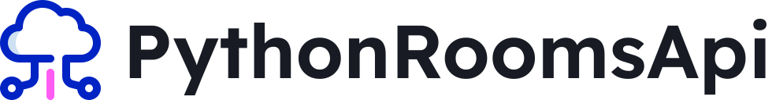

<h1 align="center">
    
</h1>

<h2 align="center">

[](https://github.com/pauloreis7/PythonRoomsApi/issues)
[](https://github.com/pauloreis7/PythonRoomsApi)
[](https://github.com/pauloreis7/PythonRoomsApi/commits)
[](https://github.com/pauloreis7/PythonRoomsApi/stargazers)
[](https://github.com/pauloreis7/PythonRoomsApi/blob/master/LICENSE)

</h2>

<h4 align="center">🏁 Application already finished 🏁</h4>

<p align="center">☁️ Full Python api RESTful for users and teachers to manage courses. 📖</p>

## 🔗 Index

---

 <p>👉 <a href="#about">About the project</a> </p>
 <p>👉 <a href="#func">Features</a> </p>
 <p>👉 <a href="#techs">Technologies</a> </p>
 <p>👉 <a href="#requests">Project Prerequisites</a> </p>
 <p>👉 <a href="#work">Download and execution</a> </p>
 <p>👉 <a href="#contribute">Contribute with the project</a> </p>
 <p>👉 <a href="#author">Author</a> </p>
 <p>👉 <a href="#license">License</a> </p>

<a id="about"></a>

## 🔎 About the project

---

<p>API for managing a course platform, users can be teachers and create their courses with each course having its own sections.</p>

<a id="func"></a>

## ✅ Features

---

-   [x] Create users who can be teachers
-   [x] Complete course management created by a teacher
-   [x] Complete management of sections of a course

<a id="techs"></a>

## 🧪 Technologies

---

### 💻 Project developed with the following technologies

-   [Python](https://www.python.org/)
-   [Fastapi](https://fastapi.tiangolo.com/)
-   [SQLAlchemy / Alembic](https://www.sqlalchemy.org/)
-   [Pydantic](https://pydantic-docs.helpmanual.io/)
-   [Pytest](https://docs.pytest.org/en/7.1.x/)
-   [Pylint](https://pylint.pycqa.org/en/latest/)
-   [Poetry](https://python-poetry.org/)
-   [Docker](https://www.docker.com/)

<a id="requests"></a>

## 🚨 Project Prerequisites

---

Before you start, you will need to have the following tools installed on your machine:

-   [Git](https://git-scm.com)
-   [Python](https://www.python.org/)
-   [Poetry](https://python-poetry.org/)

🐳 Run the containerized api (Docker)

-   [Docker-compose](https://docs.docker.com/compose/)

💡 Also, it is good to have an editor to work with the code like [VSCode](https://code.visualstudio.com/)

<a id="work"></a>

## 🏄‍♂️ Download and execution

---

```bash

# Clone the repository
$ git clone <https://github.com/pauloreis7/PythonRoomsApi>

# Install the project dependencies
$ poetry install

# ❗Select python interpreter to venv
# ❗Create envs (.env.example)

# Create database (docker example)
$ docker run --name dev-postgres -e POSTGRES_PASSWORD=c011f0ae -p 5433:5432 -d postgres

# Run the tests
$ pytest -v

# Run the server
$ python .\src\run.py

# The app will start on port defined in PORT env (default 8080)
access  <http://localhost:8080>
access docs  <http://localhost:8080/docs>

```

## 🐳 Run the containerized api (docker-compose)

---

```bash

# Clone the repository
$ git clone <https://github.com/pauloreis7/PythonRoomsApi>

# Run the server
$ docker compose up

# The app will start on port defined in PORT env (default 8080)
access  <http://localhost:8080>
access docs  <http://localhost:8080/docs>

```

<a id="contribute"></a>

## 🎉 How Contribute

[](https://github.com/pauloreis7/PythonRoomsApi/pulls)

---

<b>1. Fork the project.</b> <br />
<b>2. Create a new branch with your changes: git 3. checkout -b feature/my-feature</b> <br />
<b>3. Save your changes and create a commit message telling what you have done: git commit -m "feature: My new feature</b> <br />
<b>4. Submit your changes: git push origin my-feature</b>

<a id="author"></a>

## Author

---

## 👨‍💻 Author

<a href="https://github.com/pauloreis7">


<b>Paulo Reis</b> 🏆

</a>

<p>Made by Paulo Reis 🤴 Contact me 👋</p>

<a href = "mailto:paulosilvadosreis2057@gmail.com"></a>
<a href="https://www.linkedin.com/in/paulo-reis7/" target="_blank"></a>
<a href="https://www.instagram.com/pauloreis.7" target="_blank"></a>

<a id="license"></a>

## 📝 License

---

This project is under the MIT license. See the [LICENSE](LICENSE) file for more details.🏛️
